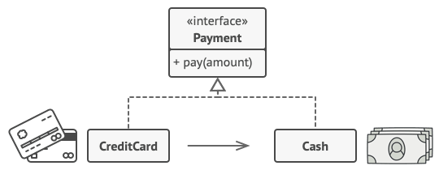
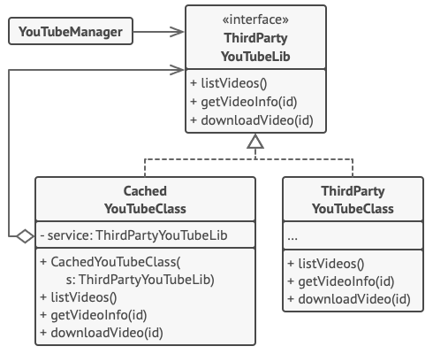

# Design Pattern Presentation

# Proxy

### Intent

* Is a structural design pattern
* Let you provide a substitute or placeholder for another object

### Problem

**Example:** A massive object that consumes of system resources.

<figure>
  
  <figcaption>
      Database queries can be really slow.
  </figcaption>
</figure>

**Approach:**
* Lazy initialization?
* Put this code directly into our object's class

### Solution
A new proxy class with the same interface as an original service object.  

<figure>
  
  <figcaption>
      The proxy disguises itself as a database object. It can handle lazy initialization and result caching without the client or the real database object even knowing.
  </figcaption>
</figure>

Benefit? 

### Real-World Analogy

<figure>
  
  <figcaption>
      Credit cards can be used for payments just the same as cash.
  </figcaption>
</figure>


### Structure


###  Pseudocode

This example illustrates how the Proxy pattern can help to introduce lazy initialization and caching to a 3rd-party YouTube integration library.

<figure>
  
  <figcaption>
      Caching results of a service with a proxy.
  </figcaption>
</figure>

The library provides us with the video downloading class. However, it’s very inefficient. If the client application requests the same video multiple times, the library just downloads it over and over, instead of caching and reusing the first downloaded file.

The proxy class implements the same interface as the original downloader and delegates it all the work. However, it keeps track of the downloaded files and returns the cached result when the app requests the same video multiple times.

```
interface ThirdPartyYouTubeLib is
    method listVideos()
    method getVideoInfo(id)
    method downloadVideo(id)
    
class ThirdPartyYouTubeClass implements ThirdPartyYouTubeLib is
    method listVideos() is
        // Send an API request to YouTube.

    method getVideoInfo(id) is
        // Get metadata about some video.

    method downloadVideo(id) is
        // Download a video file from YouTube.

class CachedYouTubeClass implements ThirdPartyYouTubeLib is
    private field service: ThirdPartyYouTubeLib
    private field listCache, videoCache
    field needReset

    constructor CachedYouTubeClass(service: ThirdPartyYouTubeLib) is
        this.service = service

    method listVideos() is
        if (listCache == null || needReset)
            listCache = service.listVideos()
        return listCache

    method getVideoInfo(id) is
        if (videoCache == null || needReset)
            videoCache = service.getVideoInfo(id)
        return videoCache

    method downloadVideo(id) is
        if (!downloadExists(id) || needReset)
            service.downloadVideo(id)
            
class YouTubeManager is
    protected field service: ThirdPartyYouTubeLib

    constructor YouTubeManager(service: ThirdPartyYouTubeLib) is
        this.service = service

    method renderVideoPage(id) is
        info = service.getVideoInfo(id)
        // Render the video page.

    method renderListPanel() is
        list = service.listVideos()
        // Render the list of video thumbnails.

    method reactOnUserInput() is
        renderVideoPage()
        renderListPanel()
        
class Application is
    method init() is
        aYouTubeService = new ThirdPartyYouTubeClass()
        aYouTubeProxy = new CachedYouTubeClass(aYouTubeService)
        manager = new YouTubeManager(aYouTubeProxy)
        manager.reactOnUserInput()
```

### Applicability

* Lazy initialization (virtual proxy)
* Access control
* Local execution of a remote service (remote proxy)
* Logging requests
* Caching request results (caching proxy)
* Smart reference

### Pros and Cons

**Pros**
* You can control the service object without clients knowing about it.
* You can manage the lifecycle of the service object when clients don’t care about it.
* The proxy works even if the service object isn’t ready or is not available.
* Open/Closed Principle. You can introduce new proxies without changing the service or clients.

**Cons**
* The code may become more complicated since you need to introduce a lot of new classes.
* The response from the service might get delayed.

### Code Examples

## Observer

### Intent

* Is a behavioral design pattern
* Let you define a subcription mechanism to notify multiple objects about any events that happen to the object they're' observing


### Problem

Imagine that you have two type of objects: a Customer and a Store. The customer is very interested in a particular brand of a product.

<figure>
  
  <figcaption>
      Visiting the store vs. sending spam
  </figcaption>
</figure>

### Solution

Add a subscription mechanism to the publisher class so individual objects can subscribe to or unsubscribe from
This mechanism consists of:
* An array field to storing a list of references to subscriber objects
* Several public methods which allow adding subscribers to and removing them from that list

<figure>
  
  <figcaption>
      Visiting the store vs. sending spam
  </figcaption>
</figure>

It’s crucial that all subscribers implement the same interface  and that the publisher communicates with them only via that interface.

### Structure


### Pseudocode
In this example, the Observer pattern lets the text editor object notify other service objects about changes in its state

<figure>
  
  <figcaption>
      Notifying objects about events that happen to other objects.
  </figcaption>
</figure>

```
class EventManager is
    private field listeners: hash map of event types and listeners

    method subscribe(eventType, listener) is
        listeners.add(eventType, listener)

    method unsubscribe(eventType, listener) is
        listeners.remove(eventType, listener)

    method notify(eventType, data) is
        foreach (listener in listeners.of(eventType)) do
            listener.update(data)
            
class Editor is
    public field events: EventManager
    private field file: File

    constructor Editor() is
        events = new EventManager()

    // Methods of business logic can notify subscribers about
    // changes.
    method openFile(path) is
        this.file = new File(path)
        events.notify("open", file.name)

    method saveFile() is
        file.write()
        events.notify("save", file.name)
        
interface EventListener is
    method update(filename)
    
class LoggingListener implements EventListener is
    private field log: File
    private field message: string

    constructor LoggingListener(log_filename, message) is
        this.log = new File(log_filename)
        this.message = message

    method update(filename) is
        log.write(replace('%s',filename,message))
        
class EmailAlertsListener implements EventListener is
    private field email: string
    private field message: string

    constructor EmailAlertsListener(email, message) is
        this.email = email
        this.message = message

    method update(filename) is
        system.email(email, replace('%s',filename,message))
        
class Application is
    method config() is
        editor = new Editor()

        logger = new LoggingListener(
            "/path/to/log.txt",
            "Someone has opened the file: %s")
        editor.events.subscribe("open", logger)

        emailAlerts = new EmailAlertsListener(
            "admin@example.com",
            "Someone has changed the file: %s")
        editor.events.subscribe("save", emailAlerts)

```

### Applicability

* Use the Observer pattern when changes to the state of one object may require changing other objects, and the actual set of objects is unknown beforehand or changes dynamically.

*  Use the pattern when some objects in your app must observe others, but only for a limited time or in specific cases.


### Pros and Cons

#### Pros
* *Open/Closed Principle.* You can introduce new subscriber classes without having to change the publisher’s code (and vice versa if there’s a publisher interface).
* You can establish relations between objects at runtime.

#### Cons
* Subscribers are notified in random order.
